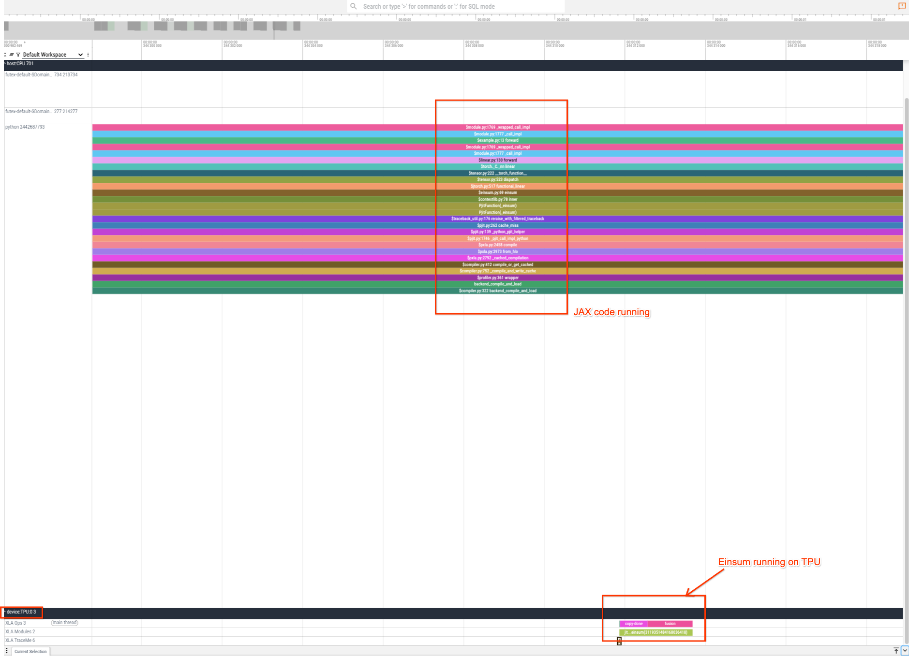

# Getting Started

## Installation

First install torch CPU:

``` bash
# On Linux.
pip install torch --index-url https://download.pytorch.org/whl/cpu

# Or on Mac.
pip install torch
```

Then install JAX for the accelerator you want to use:

``` bash
# On Google Cloud TPU.
pip install -U jax[tpu]

# Or, on GPU machines.
pip install -U jax[cuda12]

# Or, on Linux CPU machines or Macs.
pip install -U jax
```

Finally install torchax:

``` bash
pip install torchax
```

You can also install from source if you prefer the lastest torchax:

``` bash
pip install git+https://github.com/google/torchax.git@main
```

## Adopt JAX with ease

Suppose we have this toy model in PyTorch, and we want to run this model
with JAX.

``` python
import torch
import torch.nn as nn

class MyModel(nn.Module):
    def __init__(self):
        super().__init__()
        self.fc1 = nn.Linear(28 * 28, 120)
        self.fc2 = nn.Linear(120, 84)
        self.fc3 = nn.Linear(84, 10)

    def forward(self, x):
        x = x.view(-1, 28 * 28)
        x = torch.nn.functional.relu(self.fc1(x))
        x = torch.nn.functional.relu(self.fc2(x))
        x = self.fc3(x)
        return x

m = MyModel()
inputs = torch.randn(3, 3, 28, 28, device='cuda')
res = m(inputs)
```

Instead of rewriting the above in JAX (say, with NeuralNetwork libraries
like `flax` or `equinox`). One can run the above model in JAX with these
changes:

``` diff
import torch
import torch.nn as nn
+ import torchax
+ torchax.enable_globally()

class MyModel(nn.Module):
    def __init__(self):
        super().__init__()
        self.fc1 = nn.Linear(28 * 28, 120)
        self.fc2 = nn.Linear(120, 84)
        self.fc3 = nn.Linear(84, 10)

    def forward(self, x):
        x = x.view(-1, 28 * 28)
        x = torch.nn.functional.relu(self.fc1(x))
        x = torch.nn.functional.relu(self.fc2(x))
        x = self.fc3(x)
        return x

m = MyModel()
- inputs = torch.randn(3, 3, 28, 28, device='cuda')
+ inputs = torch.randn(3, 3, 28, 28, device='jax')
+ m.to('jax')
res = m(inputs)
```

That is it! You are now using JAX as the backend to execute the above
model.

Now a bit of explanation:

``` python
import torchax
torchax.enable_globally()
```

The 2 lines above enables `torchax` and allows us to capture the PyTorch
operators that we are running.

Then, you can use a `jax` device:

``` python
inputs = torch.randn(3, 3, 28, 28, device='jax')
m = MyModel().to('jax')
```

Here, the `jax` behaves like another PyTorch device, like
`cuda` device on GPUs.

## Is it really running on JAX?

One to to see and believe that it's actually running JAX, one can
verify by capturing [JAX profiler traces](https://docs.jax.dev/en/latest/profiling.html) and see the JAX
math running:

``` python
import torch
import torch.nn as nn
import torchax
torchax.enable_globally()

class MyModel(nn.Module):
    def __init__(self):
        super().__init__()
        self.fc1 = nn.Linear(28 * 28, 120)
        self.fc2 = nn.Linear(120, 84)
        self.fc3 = nn.Linear(84, 10)

    def forward(self, x):
        x = x.view(-1, 28 * 28)
        x = torch.nn.functional.relu(self.fc1(x))
        x = torch.nn.functional.relu(self.fc2(x))
        x = self.fc3(x)
        return x

m = MyModel()
inputs = torch.randn(3, 3, 28, 28, device='jax')
m.to('jax')

import jax
with jax.profiler.trace('/tmp/jax-trace', create_perfetto_link=True):
    res = m(inputs)
```

Running the above (using a Google TPU VM that I happen to have) yields:



We can see we have JAX ops running on the accelerator.

## Compiling with jax.jit

Running JAX code through torchax front-end this way, while runs fine, is
not very fast. We can see from the above in the profiler, there are a
lots of time spend in compiling XLA operations.

For people familiar with JAX, you get JAX's most performance benefits
through compiling. In fact, as it pointed in [this github
post](https://github.com/jax-ml/jax/discussions/13960), the perfornace
is day and night. So even though we succeeded in running the model on
JAX, but we are running JAX's eager model. Now let's compile the model
to unlock the performance benefits of JAX:

``` python
import torch
import torch.nn as nn
import torchax
torchax.enable_globally()

class MyModel(nn.Module):
    def __init__(self):
        super().__init__()
        self.fc1 = nn.Linear(28 * 28, 120)
        self.fc2 = nn.Linear(120, 84)
        self.fc3 = nn.Linear(84, 10)

    def forward(self, x):
        x = x.view(-1, 28 * 28)
        x = torch.nn.functional.relu(self.fc1(x))
        x = torch.nn.functional.relu(self.fc2(x))
        x = self.fc3(x)
        return x

m = MyModel()
inputs = torch.randn(3, 3, 28, 28, device='jax')
m.to('jax')

m_jitted = torchax.compile(m)

import jax
import time

for i in range(3)
    start = time.perf_counter()
    res = m(inputs)
    res.apply_jax_(jax.block_until_ready)
    end = time.perf_counter()
    print(f'iteration {i} took {end - start}s')

with jax.profiler.trace('/tmp/jax-trace', create_perfetto_link=True):
    res = m(inputs)
    res.apply_jax_(jax.block_until_ready)
```

The output is

``` text
iteration 0 took 0.06629770500876475s
iteration 1 took 0.00022945000091567636s
iteration 2 took 0.00016760900325607508s
```

We can see that the first call to the model is slower, because it's
compile time plus runtime. The second and third run are just the runtime
and is much faster.

Looking the profiler output, we can also see that the ops are now fused.

{.align-center}

because compiling the model (using `jax.jit`, which is using XLA
compiler under the hood) allows XLA fuse operations for better
performance.

For running a more serious model, here are a 3-series blog on running
HuggingFace's version of Llama-3 7B model on TPUs, using Tensor
parallel on 8 chips:

- <https://huggingface.co/blog/qihqi/huggingface-jax-01>
- <https://huggingface.co/blog/qihqi/huggingface-jax-02>
- <https://huggingface.co/blog/qihqi/huggingface-jax-03>
