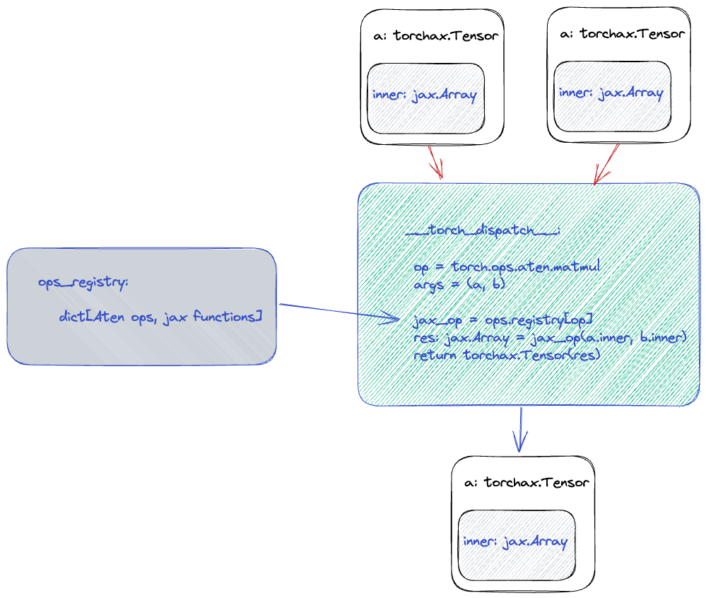

# How it Works

## Tensor subclass and eager mode

When you do:

```python
a = torch.randn((2, 2), device='jax')
print(a)
print(type(a))
```

It will say that `a` is an instance of `torchax.tensor.Tensor` class.

The class `torchax.tensor.Tensor` is a subclass of `torch.Tensor`.
It overrides `__torch_dispatch__` properly so that regular PyTorch operators,
such as `torch.matmul`, to work as expected.

It roughly looks like this (with some details removed):

The complete class impl is at [tensor.py](https://github.com/google/torchax/blob/760d1dfd3800cf43ef93b6b25303376dafd6b988/torchax/tensor.py#L54)

``` python
class Tensor(torch.Tensor):

    @staticmethod
    def __new__(cls, elem):
        return torch.Tensor._make_wrapper_subclass(
            cls,
            shape,
            dtype=dtype,
            device='meta',
            requires_grad=False,
        )

    def __init__(self, elem: jax.Array):
        super().__init__()
        self._elem = elem

    __torch_function__ = torch._C._disabled_torch_function_impl

    @classmethod
    def __torch_dispatch__(cls, func, types, args=(), kwargs=None):
        # here assumes ALL tensors in args / kwargs are
        # instances of Tensor
        args, kwargs = unwrap((args, kwargs))
        jax_func = some_registry[func]
        res = jax_func(*args, **kwargs)
        return wrap(res)

    def wrap(tree):
        # wrap jax.Array with Tensor
        return pytree.tree_map_only(
            jax.Array, Tensor, tree)

    def unwrap(tree):
        # get jax.Array out ofTensor
        return pytree.tree_map_only(
            Tensor, lambda x: x._elem, tree)
```

In other words, assuming that we have a function that takes `jax.Array`
as input and returns `jax.Array` but otherwise implement the same
semantics as a [ATen]{.title-ref} op; then, using this tensor we would
be able to route the call to this jax function.

The
[jaten.py](https://github.com/google/torchax/blob/master/torchax/ops/jaten.py)
file defines some of those ops.

Let\'s take `aten::matmul` as example:

``` python
@op(torch.ops.aten.matmul)
def _aten_matmul(x, y):
    return jnp.matmul(x, y)
```

The `@op` decorator just puts this function into `some_registry`
dictionary.

`_aten_add` has same signature as `torch.ops.aten.add` but takes
`jax.Array` as input.



Now, when `torch.matmul` is called; we will get the information and swap
it to a JAX version of that function.

In otherwords, because our tensor subclass implements all the operators
that PyTorch has, thus, a PyTorch model cannot tell a difference because
it and regular CPU tensor. ( In other words, our subclass obeys the
[Liskov Substitution
Principle](https://en.wikipedia.org/wiki/Liskov_substitution_principle)).

Therefore, when a Pytorch Model (`torch.nn.Module`) receives our special
tensor, it will do math on it without knowing that we sneaked in a
`jax.Array`.


**NOTE:** This mechanism of using a Python numerical library as a
PyTorch backend is not JAX specific. Here is an example here Apple MLX
is used as a PyTorch backend the same way:
<https://github.com/qihqi/tnt>
